# DP-800 Lab 02 – Implementación de objetos de programabilidad con SQL

**Autor:** Emmanuel Grande Sierra

---

## 1. Conexión a AdventureWorksLT

Verificamos que la base de datos de ejemplo está disponible y accesible consultando sus tablas principales.

### 1.1. Ejecutamos las tres consultas de verificación sobre `SalesLT.Customer`, `SalesLT.SalesOrderHeader` y `SalesLT.Product` para confirmar que devuelven datos.

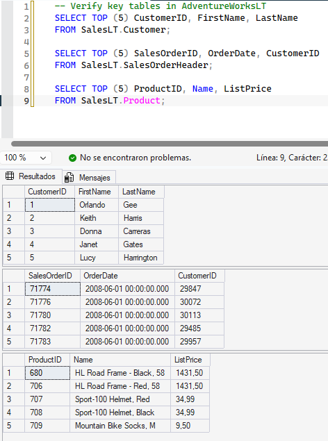

**Inconvenientes:** ninguno

---

## 2. Creación de una vista para simplificar consultas

Creamos una vista que combina clientes y pedidos ocultando la complejidad del `JOIN` al código de aplicación.

### 2.1. Creamos la vista `SalesLT.vCustomerOrders` que une `Customer` y `SalesOrderHeader`.

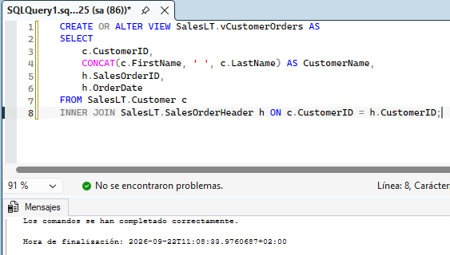

**Inconvenientes:** ninguno

### 2.2. Consultamos la vista con `SELECT TOP 5` ordenado por fecha para validar que devuelve datos correctamente.

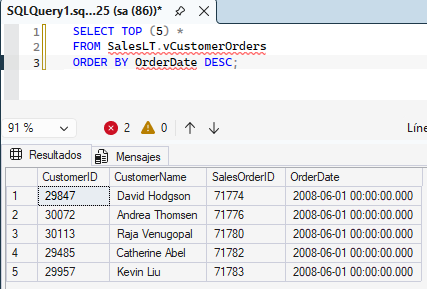

**Inconvenientes:** Saltaron los siguiente errores pero se ejecutó correctamente.

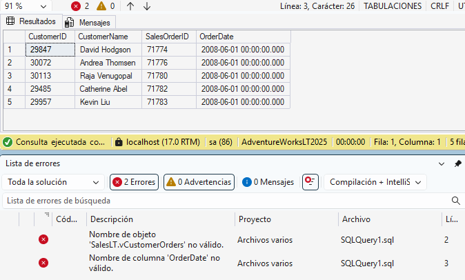

---

## 3. Stored procedure para procesar un pedido

Encapsulamos la lógica de negocio de añadir una línea de pedido dentro de un procedimiento almacenado con transacción.

### 3.1. Creamos el procedimiento `dbo.AddOrderLineItem` que valida producto y pedido, inserta la línea y recalcula el subtotal del pedido.

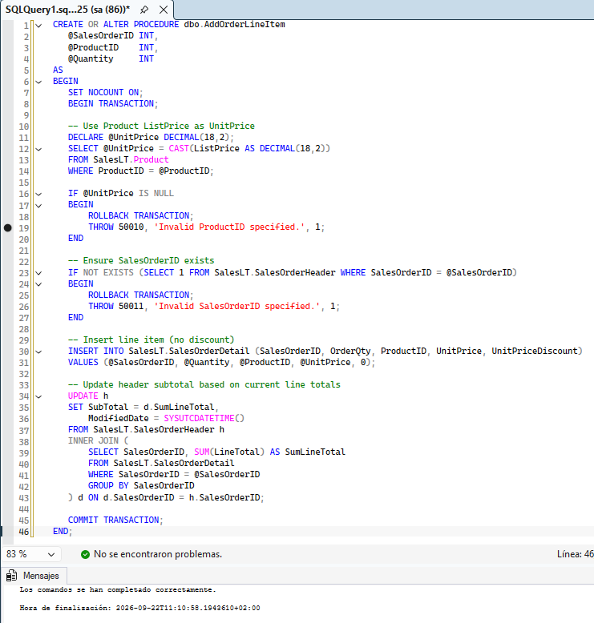

**Inconvenientes:** ninguno

### 3.2. Ejecutamos el procedimiento con un `SalesOrderID` real y verificamos que la línea se insertó y el subtotal se actualizó.

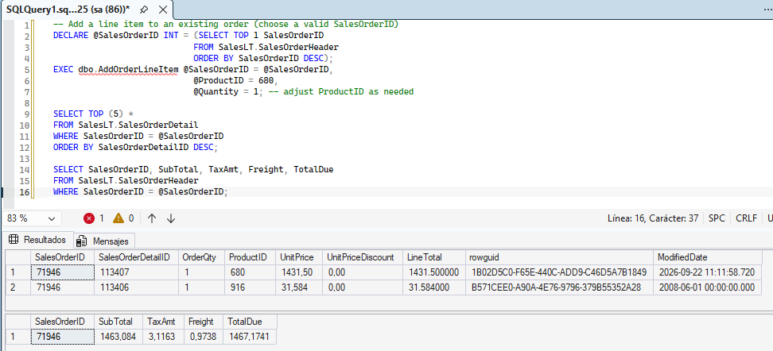

**Inconvenientes:** Saltaron los siguiente errores pero se ejecutó correctamente.

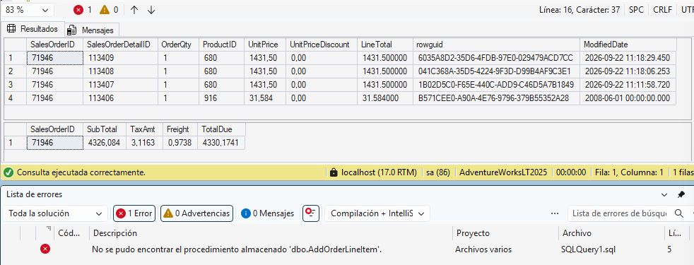

---

## 4. Función escalar para cálculos reutilizables

Creamos una función escalar que devuelve el total de un pedido sumando sus líneas de detalle.

### 4.1. Creamos la función `dbo.fnOrderTotal` que recibe un `OrderID` y retorna la suma de `LineTotal`.

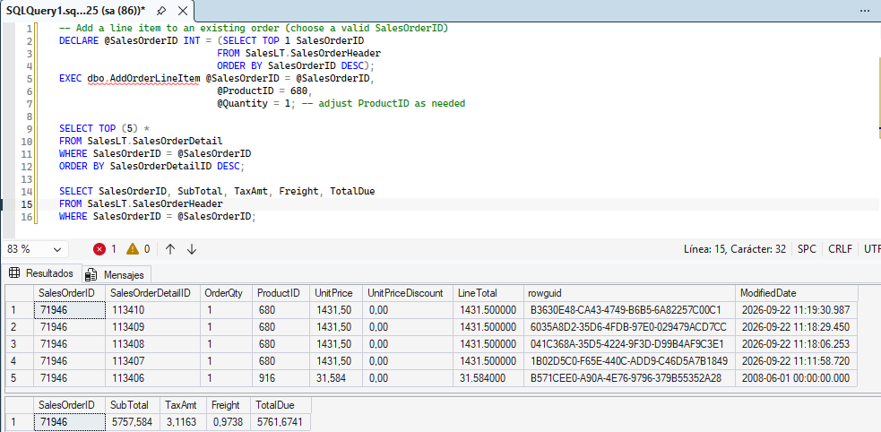

**Inconvenientes:** Saltaron los siguiente errores pero se ejecutó correctamente.

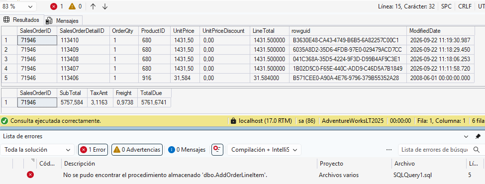

### 4.2. Usamos la función en una consulta agrupada sobre `SalesOrderDetail` para obtener el total por pedido.

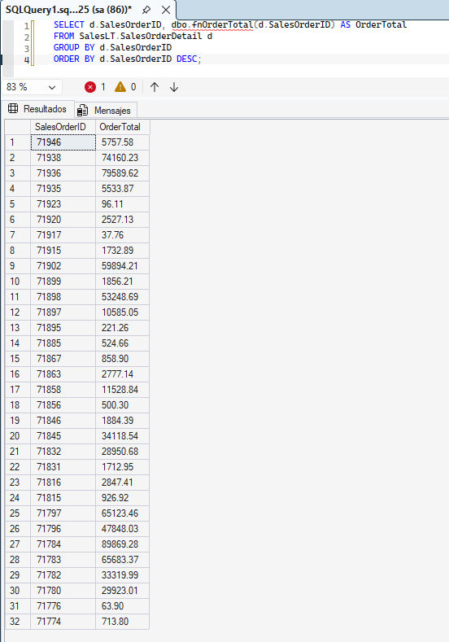

**Inconvenientes:** Saltaron los siguiente errores pero se ejecutó correctamente.

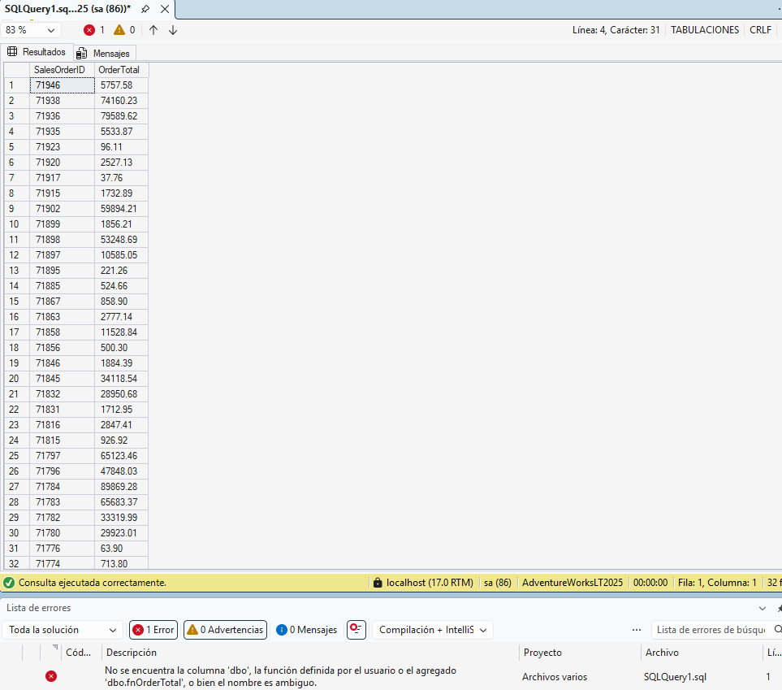

---

## 5. Función de tabla en línea (TVF)

Creamos una TVF que devuelve los pedidos de un cliente concreto, útil en cláusulas `SELECT` y `JOIN`.

### 5.1. Creamos la función `dbo.GetCustomerOrders` que filtra pedidos por `CustomerID`.

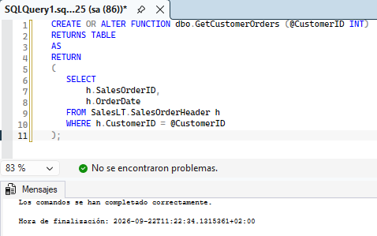

**Inconvenientes:** ninguno

### 5.2. Consultamos la función directamente para un cliente específico ordenando por fecha.

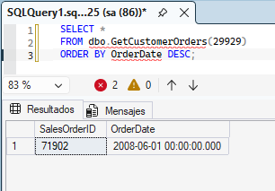

**Inconvenientes:** Saltaron los siguiente errores pero se ejecutó correctamente.

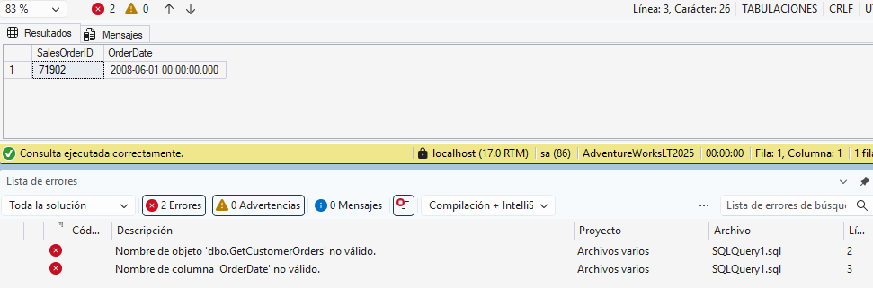

### 5.3. Cruzamos la función con la tabla `Customer` usando `CROSS APPLY` para obtener nombre del cliente junto a sus pedidos.

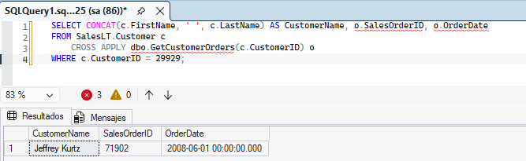

**Inconvenientes:** Saltaron los siguiente errores pero se ejecutó correctamente.

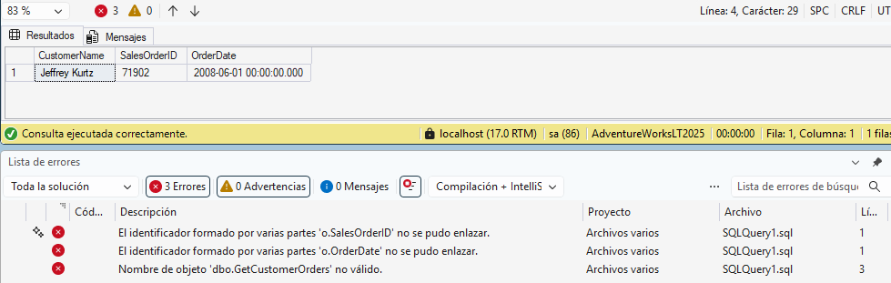

---

## 6. Trigger para registrar cambios

Añadimos un trigger que loguea automáticamente los cambios en el total de un pedido cuando se modifica `SalesOrderDetail`.

### 6.1. Creamos la tabla de auditoría `dbo.OrderAudit` y el trigger `SalesLT.trg_LogOrderTotalChange` sobre `SalesOrderDetail`.

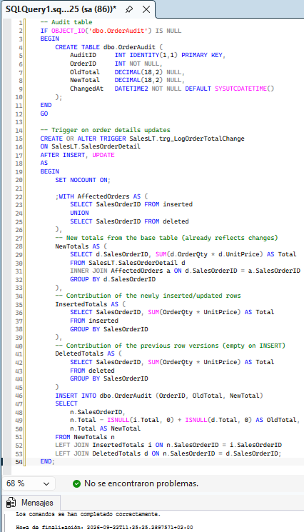

**Inconvenientes:** ninguno

### 6.2. Actualizamos la cantidad de una línea de pedido y comprobamos que el trigger registró el cambio en `dbo.OrderAudit`.

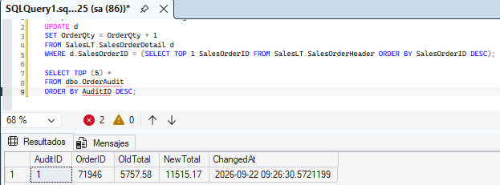

**Inconvenientes:** Saltaron los siguiente errores pero se ejecutó correctamente.

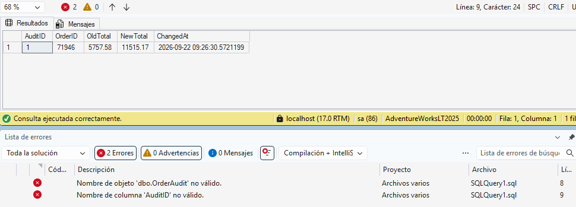

---

> 📎 **Recursos**  
> - [Módulo teórico – Microsoft Learn](https://learn.microsoft.com/en-us/training/modules/design-implement-database-objects/)  
> - [Lab oficial – Microsoft Learning](https://microsoftlearning.github.io/mslearn-sql-developer/Instructions/Labs/02-implement-programmability-objects.html)
